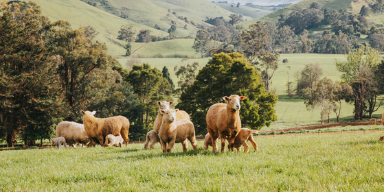

# CSIRO Pasture Biomass Prediction


<p align="center">
  
</p>


A deep learning solution for predicting pasture biomass from top-view images. This project achieved **28th place** on the Private Leaderboard and **105th place** on the Public Leaderboard in the CSIRO Image2Biomass Prediction competition.

## Overview

This repository contains a dual-pathway ensemble approach that combines:
- **DINO v3 Vision Transformer** for visual feature extraction
- **SigLIP + GBDT** for semantic feature understanding

The model predicts five biomass components from pasture images:
- **Dry_Green_g**: Green vegetation biomass
- **Dry_Dead_g**: Dead/senescent material biomass
- **Dry_Clover_g**: Clover component biomass
- **GDM_g**: Green Dry Matter (Green + Clover)
- **Dry_Total_g**: Total biomass

## Results

| Metric | Score |
|--------|-------|
| CV R² (Mean) | 0.8438 ± 0.0206 |
| Private LB | 28th |
| Public LB | 105th |

## Installation

```bash
# Clone the repository
git clone https://github.com/zulqarnainalipk/CSIRO-Biomass-Prediction.git
cd csiro-biomass-prediction

# Create virtual environment
python -m venv venv
source venv/bin/activate  # On Windows: venv\Scripts\activate

# Install dependencies
pip install -r requirements.txt
```

## Requirements

```
torch>=2.0.0
torchvision>=0.15.0
timm>=0.9.0
albumentations>=1.3.0
pandas>=2.0.0
numpy>=1.24.0
opencv-python>=4.7.0
scikit-learn>=1.2.0
lightgbm>=4.0.0
catboost>=1.2.0
transformers>=4.30.0
tqdm>=4.65.0
```

## Project Structure

```
csiro-biomass-prediction/
├── README.md
├── requirements.txt
├── LICENSE
├── .gitignore
├── train.py              # Training script
├── inference.py          # Inference script
├── src/
│   ├── __init__.py
│   ├── config.py         # Configuration settings
│   ├── dataset.py        # Dataset class
│   ├── model.py          # Model architecture
│   ├── loss.py           # Custom loss function
│   ├── metrics.py        # Evaluation metrics
│   ├── transforms.py     # Data augmentation
│   └── utils.py          # Utility functions
├── notebooks/
│   └── exploration.ipynb
├── docs/
│   └── architecture.md
└── data/
    └── (sample data format)
```

## Usage

### Training

```bash
python train.py \
    --data_path /path/to/data \
    --output_dir /path/to/output \
    --model_name vit_huge_plus_patch16_dinov3.lvd1689m \
    --epochs 180 \
    --batch_size 4 \
    --n_folds 3
```

### Inference

```bash
python inference.py \
    --data_path /path/to/data \
    --models_dir /path/to/models \
    --output_path submission.csv
```

## Model Architecture

### DINO v3 Pathway

The primary pathway uses DINO v3 huge as the backbone with custom modifications:

1. **Image Splitting**: Each 2000x1000 image is split vertically into two 1000x1000 halves
2. **Resize**: Each half is resized to 768x384 (divisible by DINO v3's 16x16 patch size)
3. **Feature Extraction**: DINO v3 processes each half independently
4. **Fusion**: Features are concatenated and processed through Local Mamba blocks
5. **Prediction**: Three separate heads predict Green, Dead, and Clover

### SigLIP Pathway

The secondary pathway provides semantic understanding:

1. **Patch Extraction**: Images are split into 520x520 patches with 16px overlap
2. **Embedding**: SigLIP SO400M generates 1152-dim embeddings
3. **Semantic Scoring**: Concept-based similarity scoring (bare, sparse, medium, dense, green, dead, clover, grass)
4. **Feature Engineering**: PCA, PLS regression, and Gaussian Mixture modeling
5. **GBDT Ensemble**: LightGBM, CatBoost, GradientBoosting, and HistGradientBoosting

### Ensemble Strategy

Final predictions combine both pathways:
- DINO v3: 75% weight
- SigLIP + GBDT: 25% weight

## Key Design Decisions

### Image Splitting Strategy

Splitting the 2000x1000 images vertically provides:
- More spatial diversity per image
- Memory-efficient processing
- Complementary features from different quadrants

### 768x384 Resizing

This size is optimal because:
- Both dimensions are divisible by DINO v3's 16x16 patch size
- Maintains 2:1 aspect ratio
- Balances detail capture with memory efficiency

### Local Mamba Block

A lightweight attention mechanism that:
- Uses depthwise convolution for local pattern capture
- Implements gating mechanism for information flow control
- Maintains gradient flow through residual connections

## Dataset

The CSIRO dataset contains:
- **1,162 annotated images** from 19 sites across 4 Australian states
- **Multiple seasons** captured from 2014-2017
- **Diverse camera types** including iPhone 4/5s, Canon, Nikon, Olympus, Sony, HTC
- **70cm x 30cm quadrats** with laboratory-validated biomass measurements
You can easily downlaod the full comeptation dataset from kaggle 

## Acknowledgments

### Competition Organizers
- **CSIRO** - Commonwealth Scientific and Industrial Research Organization
- **Meat & Livestock Australia (MLA)** - Dataset provider
- **FrontierSI** - Research partner

### Open Source Projects
- [PyTorch](https://pytorch.org/) - Deep learning framework
- [timm](https://github.com/huggingface/pytorch-image-models) - Model zoo
- [Albumentations](https://albumentations.ai/) - Image augmentation
- [Hugging Face Transformers](https://huggingface.co/) - SigLIP model
- [LightGBM](https://lightgbm.readthedocs.io/) - Gradient boosting
- [CatBoost](https://catboost.ai/) - Gradient boosting

## Citation

If you use this code, please cite the original competition:

```bibtex
@misc{csiro-biomass,
  author = {Qiyu Liao, Dadong Wang, Rhys Pirie, Joshua Whelan, Rebecca Haling, Jiajun Liu, Rizwan Khokher, Xun Li, Martyna Plomecka, and Addison Howard},
  title = {CSIRO - Image2Biomass Prediction},
  publisher = {Kaggle},
  year = {2025},
  url = {https://kaggle.com/competitions/csiro-biomass}
}
```

## License

This project is licensed under the MIT License - see the [LICENSE](LICENSE) file for details.

## Author

**Zulqarnain Ali**

- GitHub: [@ZulqarnainAli](https://github.com/ZulqarnainAli)
- Kaggle: [Zulqarnain Ali](https://www.kaggle.com/johndoe2011)

---

*Built with passion for agricultural AI and sustainable farming*
