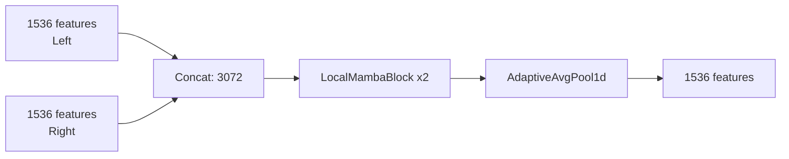

# Model Architecture Documentation

This document describes the model architecture used in the CSIRO Biomass Prediction project.

## Overview

The solution uses a dual-pathway ensemble approach:
1. **DINO v3 Pathway**: Primary pathway for visual feature extraction
2. **SigLIP + GBDT Pathway**: Secondary pathway for semantic understanding

## DINO v3 Architecture

### Image Processing

The input images (2000x1000 pixels) are processed as follows:

1. **Vertical Split**: Each image is split into two 1000x1000 halves
2. **Resize**: Each half is resized to 768x384 pixels
3. **Normalization**: Applied using dataset statistics (mean=[0.4417, 0.5036, 0.3057], std=[0.2364, 0.2355, 0.2219])

### Backbone

- **Model**: DINO v3 huge (`vit_huge_plus_patch16_dinov3.lvd1689m`)
- **Patch Size**: 16x16 pixels
- **Output Features**: 1536 dimensions per half
- **Total Features**: 3072 dimensions after concatenation

### Feature Fusion



### Local Mamba Block


### Prediction Heads

Three separate heads predict individual biomass components:

- **Head Green**: nf/2 -> nf/2 -> 1 + Softplus
- **Head Dead**: nf/2 -> nf/2 -> 1 + Softplus
- **Head Clover**: nf/2 -> nf/2 -> 1 + Softplus

Derived targets:
- GDM = Green + Clover
- Total = GDM + Dead

## SigLIP Pathway

### Patch Extraction

- **Patch Size**: 520x520 pixels
- **Overlap**: 16 pixels
- **Stride**: 504 pixels

### Embedding Generation

- **Model**: SigLIP SO400M
- **Embedding Size**: 1152 dimensions
- **Pooling**: Mean pooling across patches

### Semantic Features

Concept-based similarity scoring:

| Concept | Prompts |
|---------|---------|
| bare | bare soil, dirt ground, sparse vegetation, exposed earth |
| sparse | low density pasture, thin grass, short clipped grass |
| medium | average pasture cover, medium height grass, grazed pasture |
| dense | dense tall pasture, thick grassy volume, high biomass |
| green | lush green vibrant pasture, photosynthesizing leaves, fresh growth |
| dead | dry brown dead grass, yellow straw, senesced material |
| clover | white clover, trifolium repens, broadleaf legume |
| grass | ryegrass, blade-like leaves, fescue, grassy sward |

### Feature Engineering

1. **PCA**: 80% variance retained
2. **PLS Regression**: 8 components
3. **Gaussian Mixture**: 6 components, diagonal covariance
4. **Semantic Features**: Normalized concept scores + ratio features

### GBDT Ensemble

Four gradient boosting models:
- HistGradientBoostingRegressor
- GradientBoostingRegressor
- CatBoostRegressor
- LGBMRegressor

## Ensemble Strategy

Final predictions combine both pathways:

```
Final = 0.75 * DINO + 0.25 * SigLIP
```

Special handling:
- Dry_Clover_g: 100% DINO (GBDT doesn't predict it)
- GDM and Total: Recalculated from components
- All predictions clipped to non-negative values

## Training Configuration

| Parameter | Value |
|-----------|-------|
| Image Size | 768x384 |
| Batch Size | 4 |
| Epochs | 180 |
| LR (Backbone) | 1e-5 |
| LR (Head) | 5e-4 |
| Weight Decay | 0.01 |
| Dropout | 0.2 |
| Early Stopping | 30 epochs |
| CV Strategy | 3-Fold Stratified Group |

## Loss Function

Custom weighted Huber loss with log transform:

```python
loss = Huber(log1p(preds), log1p(labels), reduction='none')
loss = loss * weights  # [0.1, 0.1, 0.1, 0.2, 0.5]
loss = loss.mean()
```
